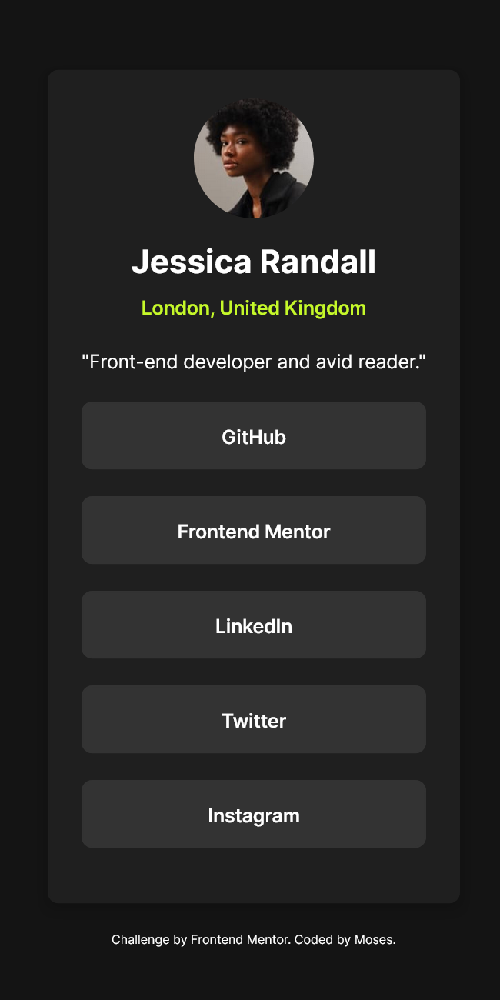

# Frontend Mentor - Social links profile solution

This is a solution to the [Social links profile challenge on Frontend Mentor](https://www.frontendmentor.io/challenges/social-links-profile-UG32l9m6dQ). Frontend Mentor challenges help you improve your coding skills by building realistic projects.

## Table of contents

- [Overview](#overview)
  - [The challenge](#the-challenge)
  - [Screenshot](#screenshot)
  - [Links](#links)
- [My process](#my-process)
  - [Built with](#built-with)
  - [What I learned](#what-i-learned)
- [Author](#author)

## Overview

### The challenge

Users should be able to:

- See hover and focus states for all interactive elements on the page

### Screenshot



### Links

- Solution URL: [social-links-profile-repo](https://github.com/mbtenkorang/social-links-profile)
- Live Site URL: [social-links-profile](https://your-live-site-url.com)

## My process

### Built with

- Semantic HTML5 markup
- Flexbox
- Mobile-first workflow
- [Vue](https://vuejs.org/) - JS Progessive Framework
- [Tailwindcss](https://tailwindcss.com/) - For styles
- [Vite](https://vite.com/) - Bundler

### What I learned

Using a v-for directive to loop over an array of objects.

```vue
<script setup>
const social_links = [
  {
    websiteUrl: "https://www.github.com",
    websiteName: "GitHub",
  },
  {
    websiteUrl: "https://www.facebook.com",
    websiteName: "Facebook",
  },
];
</script>

<template>
  <a
    v-for="(item, index) in social_links"
    :href="item.websiteUrl"
    target="_blank"
    :key="index"
  >
    <span>
      {{ item.websiteName }}
    </span>
  </a>
</template>
```

## Author

- GitHub - [Moses](https://github.com/mbtenkorang)
- Frontend Mentor - [@moses](https://www.frontendmentor.io/profile/mbtenkorang)
